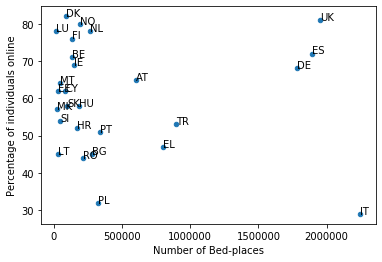
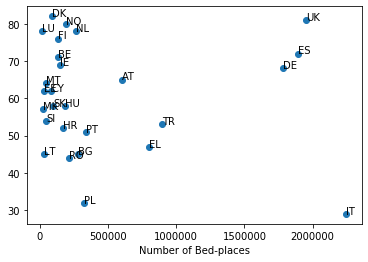

## Import Modules


```python
import pandas as pd
```

## Read files & Clean datas


```python
# noa = number_of_accomod

noa = pd.read_csv('tour_cap_nat.tsv', sep=r',|\t', engine='python')
```


```python
noa.head()
```


<div>
<style scoped>
    .dataframe tbody tr th:only-of-type {
        vertical-align: middle;
    }

    .dataframe tbody tr th {
        vertical-align: top;
    }

    .dataframe thead th {
        text-align: right;
    }
</style>
<table border="1" class="dataframe">
  <thead>
    <tr style="text-align: right;">
      <th></th>
      <th>accommod</th>
      <th>unit</th>
      <th>nace_r2</th>
      <th>geo\time</th>
      <th>2019</th>
      <th>2018</th>
      <th>2017</th>
      <th>2016</th>
      <th>2015</th>
      <th>2014</th>
      <th>...</th>
      <th>1999</th>
      <th>1998</th>
      <th>1997</th>
      <th>1996</th>
      <th>1995</th>
      <th>1994</th>
      <th>1993</th>
      <th>1992</th>
      <th>1991</th>
      <th>1990</th>
    </tr>
  </thead>
  <tbody>
    <tr>
      <th>0</th>
      <td>BEDPL</td>
      <td>NR</td>
      <td>I551</td>
      <td>AT</td>
      <td>607010</td>
      <td>615541</td>
      <td>609393</td>
      <td>601945</td>
      <td>600342</td>
      <td>598742</td>
      <td>...</td>
      <td>576602</td>
      <td>584889</td>
      <td>633601</td>
      <td>640199</td>
      <td>646125</td>
      <td>650020</td>
      <td>651003</td>
      <td>653586</td>
      <td>654127</td>
      <td>650559</td>
    </tr>
    <tr>
      <th>1</th>
      <td>BEDPL</td>
      <td>NR</td>
      <td>I551</td>
      <td>BE</td>
      <td>:</td>
      <td>136406</td>
      <td>129456</td>
      <td>129232</td>
      <td>129307</td>
      <td>127835</td>
      <td>...</td>
      <td>119365</td>
      <td>116297</td>
      <td>117513</td>
      <td>117299</td>
      <td>114887</td>
      <td>108811</td>
      <td>108205</td>
      <td>101804</td>
      <td>86472</td>
      <td>93710</td>
    </tr>
    <tr>
      <th>2</th>
      <td>BEDPL</td>
      <td>NR</td>
      <td>I551</td>
      <td>BG</td>
      <td>:</td>
      <td>286219</td>
      <td>293494</td>
      <td>281869</td>
      <td>279090</td>
      <td>271526</td>
      <td>...</td>
      <td>100663</td>
      <td>112002</td>
      <td>99953</td>
      <td>107111</td>
      <td>118112</td>
      <td>114400</td>
      <td>127450</td>
      <td>124680</td>
      <td>154350</td>
      <td>262966</td>
    </tr>
    <tr>
      <th>3</th>
      <td>BEDPL</td>
      <td>NR</td>
      <td>I551</td>
      <td>CH</td>
      <td>:</td>
      <td>274792</td>
      <td>:</td>
      <td>271710</td>
      <td>273507</td>
      <td>272636</td>
      <td>...</td>
      <td>260592</td>
      <td>260290</td>
      <td>261482</td>
      <td>262471</td>
      <td>264983</td>
      <td>264824</td>
      <td>265136</td>
      <td>266150</td>
      <td>267067</td>
      <td>269759</td>
    </tr>
    <tr>
      <th>4</th>
      <td>BEDPL</td>
      <td>NR</td>
      <td>I551</td>
      <td>CY</td>
      <td>:</td>
      <td>86252</td>
      <td>84977</td>
      <td>83251</td>
      <td>84426</td>
      <td>85150</td>
      <td>...</td>
      <td>83347</td>
      <td>85161</td>
      <td>83288</td>
      <td>83517</td>
      <td>77259</td>
      <td>74671</td>
      <td>72211</td>
      <td>68066</td>
      <td>61871</td>
      <td>57602</td>
    </tr>
  </tbody>
</table>
<p>5 rows × 34 columns</p>
</div>


```python
noa.shape
```


    (876, 34)


```python
noa
```


<div>
<table border="1" class="dataframe">
  <thead>
    <tr style="text-align: right;">
      <th></th>
      <th>accommod</th>
      <th>unit</th>
      <th>nace_r2</th>
      <th>geo\time</th>
      <th>2019</th>
      <th>2018</th>
      <th>2017</th>
      <th>2016</th>
      <th>2015</th>
      <th>2014</th>
      <th>...</th>
      <th>1999</th>
      <th>1998</th>
      <th>1997</th>
      <th>1996</th>
      <th>1995</th>
      <th>1994</th>
      <th>1993</th>
      <th>1992</th>
      <th>1991</th>
      <th>1990</th>
    </tr>
  </thead>
  <tbody>
    <tr>
      <th>0</th>
      <td>BEDPL</td>
      <td>NR</td>
      <td>I551</td>
      <td>AT</td>
      <td>607010</td>
      <td>615541</td>
      <td>609393</td>
      <td>601945</td>
      <td>600342</td>
      <td>598742</td>
      <td>...</td>
      <td>576602</td>
      <td>584889</td>
      <td>633601</td>
      <td>640199</td>
      <td>646125</td>
      <td>650020</td>
      <td>651003</td>
      <td>653586</td>
      <td>654127</td>
      <td>650559</td>
    </tr>
    <tr>
      <th>1</th>
      <td>BEDPL</td>
      <td>NR</td>
      <td>I551</td>
      <td>BE</td>
      <td>:</td>
      <td>136406</td>
      <td>129456</td>
      <td>129232</td>
      <td>129307</td>
      <td>127835</td>
      <td>...</td>
      <td>119365</td>
      <td>116297</td>
      <td>117513</td>
      <td>117299</td>
      <td>114887</td>
      <td>108811</td>
      <td>108205</td>
      <td>101804</td>
      <td>86472</td>
      <td>93710</td>
    </tr>
    <tr>
      <th>2</th>
      <td>BEDPL</td>
      <td>NR</td>
      <td>I551</td>
      <td>BG</td>
      <td>:</td>
      <td>286219</td>
      <td>293494</td>
      <td>281869</td>
      <td>279090</td>
      <td>271526</td>
      <td>...</td>
      <td>100663</td>
      <td>112002</td>
      <td>99953</td>
      <td>107111</td>
      <td>118112</td>
      <td>114400</td>
      <td>127450</td>
      <td>124680</td>
      <td>154350</td>
      <td>262966</td>
    </tr>
    <tr>
      <th>3</th>
      <td>BEDPL</td>
      <td>NR</td>
      <td>I551</td>
      <td>CH</td>
      <td>:</td>
      <td>274792</td>
      <td>:</td>
      <td>271710</td>
      <td>273507</td>
      <td>272636</td>
      <td>...</td>
      <td>260592</td>
      <td>260290</td>
      <td>261482</td>
      <td>262471</td>
      <td>264983</td>
      <td>264824</td>
      <td>265136</td>
      <td>266150</td>
      <td>267067</td>
      <td>269759</td>
    </tr>
    <tr>
      <th>4</th>
      <td>BEDPL</td>
      <td>NR</td>
      <td>I551</td>
      <td>CY</td>
      <td>:</td>
      <td>86252</td>
      <td>84977</td>
      <td>83251</td>
      <td>84426</td>
      <td>85150</td>
      <td>...</td>
      <td>83347</td>
      <td>85161</td>
      <td>83288</td>
      <td>83517</td>
      <td>77259</td>
      <td>74671</td>
      <td>72211</td>
      <td>68066</td>
      <td>61871</td>
      <td>57602</td>
    </tr>
    <tr>
      <th>...</th>
      <td>...</td>
      <td>...</td>
      <td>...</td>
      <td>...</td>
      <td>...</td>
      <td>...</td>
      <td>...</td>
      <td>...</td>
      <td>...</td>
      <td>...</td>
      <td>...</td>
      <td>...</td>
      <td>...</td>
      <td>...</td>
      <td>...</td>
      <td>...</td>
      <td>...</td>
      <td>...</td>
      <td>...</td>
      <td>...</td>
      <td>...</td>
    </tr>
    <tr>
      <th>871</th>
      <td>ESTBL</td>
      <td>PCH_PRE</td>
      <td>I553</td>
      <td>SE</td>
      <td>:</td>
      <td>-1.21</td>
      <td>-1.02</td>
      <td>0.37</td>
      <td>0</td>
      <td>-0.65</td>
      <td>...</td>
      <td>-0.2</td>
      <td>-0.1</td>
      <td>0.7</td>
      <td>0</td>
      <td>-1.5</td>
      <td>0</td>
      <td>35.2</td>
      <td>-10</td>
      <td>1.1</td>
      <td>5.4</td>
    </tr>
    <tr>
      <th>872</th>
      <td>ESTBL</td>
      <td>PCH_PRE</td>
      <td>I553</td>
      <td>SI</td>
      <td>:</td>
      <td>:</td>
      <td>2.41</td>
      <td>2.47</td>
      <td>8</td>
      <td>1.35</td>
      <td>...</td>
      <td>-2</td>
      <td>6.3</td>
      <td>0</td>
      <td>29.7</td>
      <td>-2.6</td>
      <td>2.7</td>
      <td>2.8</td>
      <td>-2.7</td>
      <td>-7.5</td>
      <td>:</td>
    </tr>
    <tr>
      <th>873</th>
      <td>ESTBL</td>
      <td>PCH_PRE</td>
      <td>I553</td>
      <td>SK</td>
      <td>:</td>
      <td>-7.14</td>
      <td>3.7</td>
      <td>-11.48</td>
      <td>-4.69</td>
      <td>-5.88</td>
      <td>...</td>
      <td>4.5</td>
      <td>407.7</td>
      <td>-75.5</td>
      <td>43.2</td>
      <td>-35.1</td>
      <td>50</td>
      <td>-25.5</td>
      <td>-37</td>
      <td>-17.3</td>
      <td>:</td>
    </tr>
    <tr>
      <th>874</th>
      <td>ESTBL</td>
      <td>PCH_PRE</td>
      <td>I553</td>
      <td>TR</td>
      <td>:</td>
      <td>814.29</td>
      <td>0</td>
      <td>:</td>
      <td>:</td>
      <td>20</td>
      <td>...</td>
      <td>:</td>
      <td>:</td>
      <td>:</td>
      <td>:</td>
      <td>:</td>
      <td>:</td>
      <td>:</td>
      <td>:</td>
      <td>:</td>
      <td>:</td>
    </tr>
    <tr>
      <th>875</th>
      <td>ESTBL</td>
      <td>PCH_PRE</td>
      <td>I553</td>
      <td>UK</td>
      <td>:</td>
      <td>:</td>
      <td>:</td>
      <td>-10.56</td>
      <td>0.47</td>
      <td>0.11</td>
      <td>...</td>
      <td>-8.4</td>
      <td>-0.5</td>
      <td>-2.9</td>
      <td>0</td>
      <td>-0.9</td>
      <td>-5.8</td>
      <td>-5.8</td>
      <td>0.3</td>
      <td>-3.1</td>
      <td>-16.7</td>
    </tr>
  </tbody>
</table>
<p>876 rows × 34 columns</p>
</div>


```python
noa.columns
```


    Index(['accommod', 'unit', 'nace_r2', 'geo\time', '2019 ', '2018 ', '2017 ',
           '2016 ', '2015 ', '2014 ', '2013 ', '2012 ', '2011 ', '2010 ', '2009 ',
           '2008 ', '2007 ', '2006 ', '2005 ', '2004 ', '2003 ', '2002 ', '2001 ',
           '2000 ', '1999 ', '1998 ', '1997 ', '1996 ', '1995 ', '1994 ', '1993 ',
           '1992 ', '1991 ', '1990'],
          dtype='object')


```python
noa = noa.rename(columns = {"geo\\time":"CC", "2016 ":"2016"})
```


```python
noa.columns
```


    Index(['accommod', 'unit', 'nace_r2', 'CC', '2019 ', '2018 ', '2017 ', '2016',
           '2015 ', '2014 ', '2013 ', '2012 ', '2011 ', '2010 ', '2009 ', '2008 ',
           '2007 ', '2006 ', '2005 ', '2004 ', '2003 ', '2002 ', '2001 ', '2000 ',
           '1999 ', '1998 ', '1997 ', '1996 ', '1995 ', '1994 ', '1993 ', '1992 ',
           '1991 ', '1990'],
          dtype='object')


```python
noa = noa[['accommod', 'unit', 'nace_r2', 'CC', '2016']]
```


```python
noa.head()
```


<div>

<table border="1" class="dataframe">
  <thead>
    <tr style="text-align: right;">
      <th></th>
      <th>accommod</th>
      <th>unit</th>
      <th>nace_r2</th>
      <th>CC</th>
      <th>2016</th>
    </tr>
  </thead>
  <tbody>
    <tr>
      <th>0</th>
      <td>BEDPL</td>
      <td>NR</td>
      <td>I551</td>
      <td>AT</td>
      <td>601945</td>
    </tr>
    <tr>
      <th>1</th>
      <td>BEDPL</td>
      <td>NR</td>
      <td>I551</td>
      <td>BE</td>
      <td>129232</td>
    </tr>
    <tr>
      <th>2</th>
      <td>BEDPL</td>
      <td>NR</td>
      <td>I551</td>
      <td>BG</td>
      <td>281869</td>
    </tr>
    <tr>
      <th>3</th>
      <td>BEDPL</td>
      <td>NR</td>
      <td>I551</td>
      <td>CH</td>
      <td>271710</td>
    </tr>
    <tr>
      <th>4</th>
      <td>BEDPL</td>
      <td>NR</td>
      <td>I551</td>
      <td>CY</td>
      <td>83251</td>
    </tr>
  </tbody>
</table>
</div>


```python
noa = noa.loc[noa['accommod'] == "BEDPL"]
noa = noa.loc[noa['unit'] == "NR"]
noa = noa.loc[noa['nace_r2'] == "I551"]
```


```python
noa.shape
```


    (41, 5)


```python
noa = noa[~noa['2016'].str.contains(":")]
noa = noa[~noa['CC'].str.contains("EU")]
noa = noa[~noa['CC'].str.contains("EA")]
```


```python
noa.values
```


    array([['BEDPL', 'NR', 'I551', 'AT', '601945 '],
           ['BEDPL', 'NR', 'I551', 'BE', '129232 '],
           ['BEDPL', 'NR', 'I551', 'BG', '281869 '],
           ['BEDPL', 'NR', 'I551', 'CH', '271710 '],
           ['BEDPL', 'NR', 'I551', 'CY', '83251 '],
           ['BEDPL', 'NR', 'I551', 'CZ', '317756 '],
           ['BEDPL', 'NR', 'I551', 'DE', '1784654 '],
           ['BEDPL', 'NR', 'I551', 'DK', '90503 '],
           ['BEDPL', 'NR', 'I551', 'EE', '32404 '],
           ['BEDPL', 'NR', 'I551', 'EL', '797995 '],
           ['BEDPL', 'NR', 'I551', 'ES', '1893978 '],
           ['BEDPL', 'NR', 'I551', 'FI', '135177 '],
           ['BEDPL', 'NR', 'I551', 'FR', '1312372 '],
           ['BEDPL', 'NR', 'I551', 'HR', '167380 '],
           ['BEDPL', 'NR', 'I551', 'HU', '181407 '],
           ['BEDPL', 'NR', 'I551', 'IE', '150083 '],
           ['BEDPL', 'NR', 'I551', 'IS', '29403 '],
           ['BEDPL', 'NR', 'I551', 'IT', '2248225 '],
           ['BEDPL', 'NR', 'I551', 'LI', '1660 '],
           ['BEDPL', 'NR', 'I551', 'LT', '28665 '],
           ['BEDPL', 'NR', 'I551', 'LU', '15689 '],
           ['BEDPL', 'NR', 'I551', 'LV', '26164 '],
           ['BEDPL', 'NR', 'I551', 'ME', '35518 '],
           ['BEDPL', 'NR', 'I551', 'MK', '19567 '],
           ['BEDPL', 'NR', 'I551', 'MT', '41684 '],
           ['BEDPL', 'NR', 'I551', 'NL', '261164 '],
           ['BEDPL', 'NR', 'I551', 'NO', '187943 '],
           ['BEDPL', 'NR', 'I551', 'PL', '325776 '],
           ['BEDPL', 'NR', 'I551', 'PT', '337175 '],
           ['BEDPL', 'NR', 'I551', 'RO', '213635 '],
           ['BEDPL', 'NR', 'I551', 'SE', '240883 '],
           ['BEDPL', 'NR', 'I551', 'SI', '45716 '],
           ['BEDPL', 'NR', 'I551', 'SK', '95774 '],
           ['BEDPL', 'NR', 'I551', 'TR', '897456 '],
           ['BEDPL', 'NR', 'I551', 'UK', '1950485 ']], dtype=object)


```python
noa['2016'] = noa['2016'].str.strip()
```


```python
noa.values
```


    array([['BEDPL', 'NR', 'I551', 'AT', '601945'],
           ['BEDPL', 'NR', 'I551', 'BE', '129232'],
           ['BEDPL', 'NR', 'I551', 'BG', '281869'],
           ['BEDPL', 'NR', 'I551', 'CH', '271710'],
           ['BEDPL', 'NR', 'I551', 'CY', '83251'],
           ['BEDPL', 'NR', 'I551', 'CZ', '317756'],
           ['BEDPL', 'NR', 'I551', 'DE', '1784654'],
           ['BEDPL', 'NR', 'I551', 'DK', '90503'],
           ['BEDPL', 'NR', 'I551', 'EE', '32404'],
           ['BEDPL', 'NR', 'I551', 'EL', '797995'],
           ['BEDPL', 'NR', 'I551', 'ES', '1893978'],
           ['BEDPL', 'NR', 'I551', 'FI', '135177'],
           ['BEDPL', 'NR', 'I551', 'FR', '1312372'],
           ['BEDPL', 'NR', 'I551', 'HR', '167380'],
           ['BEDPL', 'NR', 'I551', 'HU', '181407'],
           ['BEDPL', 'NR', 'I551', 'IE', '150083'],
           ['BEDPL', 'NR', 'I551', 'IS', '29403'],
           ['BEDPL', 'NR', 'I551', 'IT', '2248225'],
           ['BEDPL', 'NR', 'I551', 'LI', '1660'],
           ['BEDPL', 'NR', 'I551', 'LT', '28665'],
           ['BEDPL', 'NR', 'I551', 'LU', '15689'],
           ['BEDPL', 'NR', 'I551', 'LV', '26164'],
           ['BEDPL', 'NR', 'I551', 'ME', '35518'],
           ['BEDPL', 'NR', 'I551', 'MK', '19567'],
           ['BEDPL', 'NR', 'I551', 'MT', '41684'],
           ['BEDPL', 'NR', 'I551', 'NL', '261164'],
           ['BEDPL', 'NR', 'I551', 'NO', '187943'],
           ['BEDPL', 'NR', 'I551', 'PL', '325776'],
           ['BEDPL', 'NR', 'I551', 'PT', '337175'],
           ['BEDPL', 'NR', 'I551', 'RO', '213635'],
           ['BEDPL', 'NR', 'I551', 'SE', '240883'],
           ['BEDPL', 'NR', 'I551', 'SI', '45716'],
           ['BEDPL', 'NR', 'I551', 'SK', '95774'],
           ['BEDPL', 'NR', 'I551', 'TR', '897456'],
           ['BEDPL', 'NR', 'I551', 'UK', '1950485']], dtype=object)


```python
# uom = use_of_mobile

uom = pd.read_csv('tin00083.tsv', sep=r',|\t', engine='python')
```


```python
uom.head()
```


<div>

<table border="1" class="dataframe">
  <thead>
    <tr style="text-align: right;">
      <th></th>
      <th>indic_is</th>
      <th>ind_type</th>
      <th>unit</th>
      <th>geo\time</th>
      <th>2012</th>
      <th>2013</th>
      <th>2014</th>
      <th>2015</th>
      <th>2016</th>
      <th>2017</th>
      <th>2018</th>
      <th>2019</th>
    </tr>
  </thead>
  <tbody>
    <tr>
      <th>0</th>
      <td>I_IUMD</td>
      <td>EMPL_UNE</td>
      <td>PC_IND</td>
      <td>AL</td>
      <td>:</td>
      <td>:</td>
      <td>:</td>
      <td>:</td>
      <td>:</td>
      <td>:</td>
      <td>60</td>
      <td>:</td>
    </tr>
    <tr>
      <th>1</th>
      <td>I_IUMD</td>
      <td>EMPL_UNE</td>
      <td>PC_IND</td>
      <td>AT</td>
      <td>53</td>
      <td>60</td>
      <td>66</td>
      <td>74</td>
      <td>74</td>
      <td>83</td>
      <td>82</td>
      <td>90</td>
    </tr>
    <tr>
      <th>2</th>
      <td>I_IUMD</td>
      <td>EMPL_UNE</td>
      <td>PC_IND</td>
      <td>BA</td>
      <td>:</td>
      <td>:</td>
      <td>:</td>
      <td>:</td>
      <td>:</td>
      <td>:</td>
      <td>73</td>
      <td>65</td>
    </tr>
    <tr>
      <th>3</th>
      <td>I_IUMD</td>
      <td>EMPL_UNE</td>
      <td>PC_IND</td>
      <td>BE</td>
      <td>49</td>
      <td>52</td>
      <td>67</td>
      <td>77</td>
      <td>80</td>
      <td>84</td>
      <td>86</td>
      <td>93</td>
    </tr>
    <tr>
      <th>4</th>
      <td>I_IUMD</td>
      <td>EMPL_UNE</td>
      <td>PC_IND</td>
      <td>BG</td>
      <td>15</td>
      <td>22</td>
      <td>31</td>
      <td>44</td>
      <td>53</td>
      <td>67</td>
      <td>68</td>
      <td>77</td>
    </tr>
  </tbody>
</table>
</div>


```python
uom.shape
```


    (588, 12)


```python
uom
```


<div>

<table border="1" class="dataframe">
  <thead>
    <tr style="text-align: right;">
      <th></th>
      <th>indic_is</th>
      <th>ind_type</th>
      <th>unit</th>
      <th>geo\time</th>
      <th>2012</th>
      <th>2013</th>
      <th>2014</th>
      <th>2015</th>
      <th>2016</th>
      <th>2017</th>
      <th>2018</th>
      <th>2019</th>
    </tr>
  </thead>
  <tbody>
    <tr>
      <th>0</th>
      <td>I_IUMD</td>
      <td>EMPL_UNE</td>
      <td>PC_IND</td>
      <td>AL</td>
      <td>:</td>
      <td>:</td>
      <td>:</td>
      <td>:</td>
      <td>:</td>
      <td>:</td>
      <td>60</td>
      <td>:</td>
    </tr>
    <tr>
      <th>1</th>
      <td>I_IUMD</td>
      <td>EMPL_UNE</td>
      <td>PC_IND</td>
      <td>AT</td>
      <td>53</td>
      <td>60</td>
      <td>66</td>
      <td>74</td>
      <td>74</td>
      <td>83</td>
      <td>82</td>
      <td>90</td>
    </tr>
    <tr>
      <th>2</th>
      <td>I_IUMD</td>
      <td>EMPL_UNE</td>
      <td>PC_IND</td>
      <td>BA</td>
      <td>:</td>
      <td>:</td>
      <td>:</td>
      <td>:</td>
      <td>:</td>
      <td>:</td>
      <td>73</td>
      <td>65</td>
    </tr>
    <tr>
      <th>3</th>
      <td>I_IUMD</td>
      <td>EMPL_UNE</td>
      <td>PC_IND</td>
      <td>BE</td>
      <td>49</td>
      <td>52</td>
      <td>67</td>
      <td>77</td>
      <td>80</td>
      <td>84</td>
      <td>86</td>
      <td>93</td>
    </tr>
    <tr>
      <th>4</th>
      <td>I_IUMD</td>
      <td>EMPL_UNE</td>
      <td>PC_IND</td>
      <td>BG</td>
      <td>15</td>
      <td>22</td>
      <td>31</td>
      <td>44</td>
      <td>53</td>
      <td>67</td>
      <td>68</td>
      <td>77</td>
    </tr>
    <tr>
      <th>...</th>
      <td>...</td>
      <td>...</td>
      <td>...</td>
      <td>...</td>
      <td>...</td>
      <td>...</td>
      <td>...</td>
      <td>...</td>
      <td>...</td>
      <td>...</td>
      <td>...</td>
      <td>...</td>
    </tr>
    <tr>
      <th>583</th>
      <td>I_IUMD</td>
      <td>Y55_74</td>
      <td>PC_IND</td>
      <td>SI</td>
      <td>5</td>
      <td>10</td>
      <td>11</td>
      <td>12</td>
      <td>16</td>
      <td>27</td>
      <td>33</td>
      <td>48</td>
    </tr>
    <tr>
      <th>584</th>
      <td>I_IUMD</td>
      <td>Y55_74</td>
      <td>PC_IND</td>
      <td>SK</td>
      <td>8</td>
      <td>10</td>
      <td>14</td>
      <td>15</td>
      <td>20</td>
      <td>28</td>
      <td>22</td>
      <td>36</td>
    </tr>
    <tr>
      <th>585</th>
      <td>I_IUMD</td>
      <td>Y55_74</td>
      <td>PC_IND</td>
      <td>TR</td>
      <td>1</td>
      <td>2</td>
      <td>5</td>
      <td>7</td>
      <td>13</td>
      <td>19</td>
      <td>26</td>
      <td>32</td>
    </tr>
    <tr>
      <th>586</th>
      <td>I_IUMD</td>
      <td>Y55_74</td>
      <td>PC_IND</td>
      <td>UK</td>
      <td>33</td>
      <td>34</td>
      <td>45</td>
      <td>55</td>
      <td>57</td>
      <td>61</td>
      <td>61</td>
      <td>72</td>
    </tr>
    <tr>
      <th>587</th>
      <td>I_IUMD</td>
      <td>Y55_74</td>
      <td>PC_IND</td>
      <td>XK</td>
      <td>:</td>
      <td>:</td>
      <td>:</td>
      <td>:</td>
      <td>:</td>
      <td>54</td>
      <td>54</td>
      <td>63</td>
    </tr>
  </tbody>
</table>
<p>588 rows × 12 columns</p>
</div>


```python
uom.columns
```


    Index(['indic_is', 'ind_type', 'unit', 'geo\time', '2012 ', '2013 ', '2014 ',
           '2015 ', '2016 ', '2017 ', '2018 ', '2019'],
          dtype='object')


```python
uom = uom.rename(columns = {"geo\\time":"CC", "2016 ":"2016"})
```


```python
uom.columns
```


    Index(['indic_is', 'ind_type', 'unit', 'CC', '2012 ', '2013 ', '2014 ',
           '2015 ', '2016', '2017 ', '2018 ', '2019'],
          dtype='object')


```python
uom = uom[['indic_is', 'ind_type', 'unit', 'CC', '2016']]
```


```python
uom.shape
```


    (588, 5)


```python
uom = uom.loc[uom['ind_type'] == "IND_TOTAL"]
```


```python
uom.shape
```


    (42, 5)


```python
uom
```


<div>

<table border="1" class="dataframe">
  <thead>
    <tr style="text-align: right;">
      <th></th>
      <th>indic_is</th>
      <th>ind_type</th>
      <th>unit</th>
      <th>CC</th>
      <th>2016</th>
    </tr>
  </thead>
  <tbody>
    <tr>
      <th>210</th>
      <td>I_IUMD</td>
      <td>IND_TOTAL</td>
      <td>PC_IND</td>
      <td>AL</td>
      <td>:</td>
    </tr>
    <tr>
      <th>211</th>
      <td>I_IUMD</td>
      <td>IND_TOTAL</td>
      <td>PC_IND</td>
      <td>AT</td>
      <td>65</td>
    </tr>
    <tr>
      <th>212</th>
      <td>I_IUMD</td>
      <td>IND_TOTAL</td>
      <td>PC_IND</td>
      <td>BA</td>
      <td>:</td>
    </tr>
    <tr>
      <th>213</th>
      <td>I_IUMD</td>
      <td>IND_TOTAL</td>
      <td>PC_IND</td>
      <td>BE</td>
      <td>71</td>
    </tr>
    <tr>
      <th>214</th>
      <td>I_IUMD</td>
      <td>IND_TOTAL</td>
      <td>PC_IND</td>
      <td>BG</td>
      <td>45</td>
    </tr>
    <tr>
      <th>215</th>
      <td>I_IUMD</td>
      <td>IND_TOTAL</td>
      <td>PC_IND</td>
      <td>CH</td>
      <td>:</td>
    </tr>
    <tr>
      <th>216</th>
      <td>I_IUMD</td>
      <td>IND_TOTAL</td>
      <td>PC_IND</td>
      <td>CY</td>
      <td>62</td>
    </tr>
    <tr>
      <th>217</th>
      <td>I_IUMD</td>
      <td>IND_TOTAL</td>
      <td>PC_IND</td>
      <td>CZ</td>
      <td>: u</td>
    </tr>
    <tr>
      <th>218</th>
      <td>I_IUMD</td>
      <td>IND_TOTAL</td>
      <td>PC_IND</td>
      <td>DE</td>
      <td>68</td>
    </tr>
    <tr>
      <th>219</th>
      <td>I_IUMD</td>
      <td>IND_TOTAL</td>
      <td>PC_IND</td>
      <td>DK</td>
      <td>82</td>
    </tr>
    <tr>
      <th>220</th>
      <td>I_IUMD</td>
      <td>IND_TOTAL</td>
      <td>PC_IND</td>
      <td>EA</td>
      <td>59</td>
    </tr>
    <tr>
      <th>221</th>
      <td>I_IUMD</td>
      <td>IND_TOTAL</td>
      <td>PC_IND</td>
      <td>EE</td>
      <td>62</td>
    </tr>
    <tr>
      <th>222</th>
      <td>I_IUMD</td>
      <td>IND_TOTAL</td>
      <td>PC_IND</td>
      <td>EL</td>
      <td>47</td>
    </tr>
    <tr>
      <th>223</th>
      <td>I_IUMD</td>
      <td>IND_TOTAL</td>
      <td>PC_IND</td>
      <td>ES</td>
      <td>72</td>
    </tr>
    <tr>
      <th>224</th>
      <td>I_IUMD</td>
      <td>IND_TOTAL</td>
      <td>PC_IND</td>
      <td>EU27_2007</td>
      <td>59</td>
    </tr>
    <tr>
      <th>225</th>
      <td>I_IUMD</td>
      <td>IND_TOTAL</td>
      <td>PC_IND</td>
      <td>EU27_2020</td>
      <td>56</td>
    </tr>
    <tr>
      <th>226</th>
      <td>I_IUMD</td>
      <td>IND_TOTAL</td>
      <td>PC_IND</td>
      <td>EU28</td>
      <td>59</td>
    </tr>
    <tr>
      <th>227</th>
      <td>I_IUMD</td>
      <td>IND_TOTAL</td>
      <td>PC_IND</td>
      <td>FI</td>
      <td>76</td>
    </tr>
    <tr>
      <th>228</th>
      <td>I_IUMD</td>
      <td>IND_TOTAL</td>
      <td>PC_IND</td>
      <td>FR</td>
      <td>61 b</td>
    </tr>
    <tr>
      <th>229</th>
      <td>I_IUMD</td>
      <td>IND_TOTAL</td>
      <td>PC_IND</td>
      <td>HR</td>
      <td>52</td>
    </tr>
    <tr>
      <th>230</th>
      <td>I_IUMD</td>
      <td>IND_TOTAL</td>
      <td>PC_IND</td>
      <td>HU</td>
      <td>58</td>
    </tr>
    <tr>
      <th>231</th>
      <td>I_IUMD</td>
      <td>IND_TOTAL</td>
      <td>PC_IND</td>
      <td>IE</td>
      <td>69</td>
    </tr>
    <tr>
      <th>232</th>
      <td>I_IUMD</td>
      <td>IND_TOTAL</td>
      <td>PC_IND</td>
      <td>IS</td>
      <td>:</td>
    </tr>
    <tr>
      <th>233</th>
      <td>I_IUMD</td>
      <td>IND_TOTAL</td>
      <td>PC_IND</td>
      <td>IT</td>
      <td>29</td>
    </tr>
    <tr>
      <th>234</th>
      <td>I_IUMD</td>
      <td>IND_TOTAL</td>
      <td>PC_IND</td>
      <td>LT</td>
      <td>45</td>
    </tr>
    <tr>
      <th>235</th>
      <td>I_IUMD</td>
      <td>IND_TOTAL</td>
      <td>PC_IND</td>
      <td>LU</td>
      <td>78</td>
    </tr>
    <tr>
      <th>236</th>
      <td>I_IUMD</td>
      <td>IND_TOTAL</td>
      <td>PC_IND</td>
      <td>LV</td>
      <td>48 b</td>
    </tr>
    <tr>
      <th>237</th>
      <td>I_IUMD</td>
      <td>IND_TOTAL</td>
      <td>PC_IND</td>
      <td>ME</td>
      <td>:</td>
    </tr>
    <tr>
      <th>238</th>
      <td>I_IUMD</td>
      <td>IND_TOTAL</td>
      <td>PC_IND</td>
      <td>MK</td>
      <td>57</td>
    </tr>
    <tr>
      <th>239</th>
      <td>I_IUMD</td>
      <td>IND_TOTAL</td>
      <td>PC_IND</td>
      <td>MT</td>
      <td>64</td>
    </tr>
    <tr>
      <th>240</th>
      <td>I_IUMD</td>
      <td>IND_TOTAL</td>
      <td>PC_IND</td>
      <td>NL</td>
      <td>78</td>
    </tr>
    <tr>
      <th>241</th>
      <td>I_IUMD</td>
      <td>IND_TOTAL</td>
      <td>PC_IND</td>
      <td>NO</td>
      <td>80</td>
    </tr>
    <tr>
      <th>242</th>
      <td>I_IUMD</td>
      <td>IND_TOTAL</td>
      <td>PC_IND</td>
      <td>PL</td>
      <td>32</td>
    </tr>
    <tr>
      <th>243</th>
      <td>I_IUMD</td>
      <td>IND_TOTAL</td>
      <td>PC_IND</td>
      <td>PT</td>
      <td>51</td>
    </tr>
    <tr>
      <th>244</th>
      <td>I_IUMD</td>
      <td>IND_TOTAL</td>
      <td>PC_IND</td>
      <td>RO</td>
      <td>44</td>
    </tr>
    <tr>
      <th>245</th>
      <td>I_IUMD</td>
      <td>IND_TOTAL</td>
      <td>PC_IND</td>
      <td>RS</td>
      <td>:</td>
    </tr>
    <tr>
      <th>246</th>
      <td>I_IUMD</td>
      <td>IND_TOTAL</td>
      <td>PC_IND</td>
      <td>SE</td>
      <td>80 b</td>
    </tr>
    <tr>
      <th>247</th>
      <td>I_IUMD</td>
      <td>IND_TOTAL</td>
      <td>PC_IND</td>
      <td>SI</td>
      <td>54</td>
    </tr>
    <tr>
      <th>248</th>
      <td>I_IUMD</td>
      <td>IND_TOTAL</td>
      <td>PC_IND</td>
      <td>SK</td>
      <td>58</td>
    </tr>
    <tr>
      <th>249</th>
      <td>I_IUMD</td>
      <td>IND_TOTAL</td>
      <td>PC_IND</td>
      <td>TR</td>
      <td>53</td>
    </tr>
    <tr>
      <th>250</th>
      <td>I_IUMD</td>
      <td>IND_TOTAL</td>
      <td>PC_IND</td>
      <td>UK</td>
      <td>81</td>
    </tr>
    <tr>
      <th>251</th>
      <td>I_IUMD</td>
      <td>IND_TOTAL</td>
      <td>PC_IND</td>
      <td>XK</td>
      <td>:</td>
    </tr>
  </tbody>
</table>
</div>


```python
uom.values
```


    array([['I_IUMD', 'IND_TOTAL', 'PC_IND', 'AL', ': '],
           ['I_IUMD', 'IND_TOTAL', 'PC_IND', 'AT', '65 '],
           ['I_IUMD', 'IND_TOTAL', 'PC_IND', 'BA', ': '],
           ['I_IUMD', 'IND_TOTAL', 'PC_IND', 'BE', '71 '],
           ['I_IUMD', 'IND_TOTAL', 'PC_IND', 'BG', '45 '],
           ['I_IUMD', 'IND_TOTAL', 'PC_IND', 'CH', ': '],
           ['I_IUMD', 'IND_TOTAL', 'PC_IND', 'CY', '62 '],
           ['I_IUMD', 'IND_TOTAL', 'PC_IND', 'CZ', ': u'],
           ['I_IUMD', 'IND_TOTAL', 'PC_IND', 'DE', '68 '],
           ['I_IUMD', 'IND_TOTAL', 'PC_IND', 'DK', '82 '],
           ['I_IUMD', 'IND_TOTAL', 'PC_IND', 'EA', '59 '],
           ['I_IUMD', 'IND_TOTAL', 'PC_IND', 'EE', '62 '],
           ['I_IUMD', 'IND_TOTAL', 'PC_IND', 'EL', '47 '],
           ['I_IUMD', 'IND_TOTAL', 'PC_IND', 'ES', '72 '],
           ['I_IUMD', 'IND_TOTAL', 'PC_IND', 'EU27_2007', '59 '],
           ['I_IUMD', 'IND_TOTAL', 'PC_IND', 'EU27_2020', '56 '],
           ['I_IUMD', 'IND_TOTAL', 'PC_IND', 'EU28', '59 '],
           ['I_IUMD', 'IND_TOTAL', 'PC_IND', 'FI', '76 '],
           ['I_IUMD', 'IND_TOTAL', 'PC_IND', 'FR', '61 b'],
           ['I_IUMD', 'IND_TOTAL', 'PC_IND', 'HR', '52 '],
           ['I_IUMD', 'IND_TOTAL', 'PC_IND', 'HU', '58 '],
           ['I_IUMD', 'IND_TOTAL', 'PC_IND', 'IE', '69 '],
           ['I_IUMD', 'IND_TOTAL', 'PC_IND', 'IS', ': '],
           ['I_IUMD', 'IND_TOTAL', 'PC_IND', 'IT', '29 '],
           ['I_IUMD', 'IND_TOTAL', 'PC_IND', 'LT', '45 '],
           ['I_IUMD', 'IND_TOTAL', 'PC_IND', 'LU', '78 '],
           ['I_IUMD', 'IND_TOTAL', 'PC_IND', 'LV', '48 b'],
           ['I_IUMD', 'IND_TOTAL', 'PC_IND', 'ME', ': '],
           ['I_IUMD', 'IND_TOTAL', 'PC_IND', 'MK', '57 '],
           ['I_IUMD', 'IND_TOTAL', 'PC_IND', 'MT', '64 '],
           ['I_IUMD', 'IND_TOTAL', 'PC_IND', 'NL', '78 '],
           ['I_IUMD', 'IND_TOTAL', 'PC_IND', 'NO', '80 '],
           ['I_IUMD', 'IND_TOTAL', 'PC_IND', 'PL', '32 '],
           ['I_IUMD', 'IND_TOTAL', 'PC_IND', 'PT', '51 '],
           ['I_IUMD', 'IND_TOTAL', 'PC_IND', 'RO', '44 '],
           ['I_IUMD', 'IND_TOTAL', 'PC_IND', 'RS', ': '],
           ['I_IUMD', 'IND_TOTAL', 'PC_IND', 'SE', '80 b'],
           ['I_IUMD', 'IND_TOTAL', 'PC_IND', 'SI', '54 '],
           ['I_IUMD', 'IND_TOTAL', 'PC_IND', 'SK', '58 '],
           ['I_IUMD', 'IND_TOTAL', 'PC_IND', 'TR', '53 '],
           ['I_IUMD', 'IND_TOTAL', 'PC_IND', 'UK', '81 '],
           ['I_IUMD', 'IND_TOTAL', 'PC_IND', 'XK', ': ']], dtype=object)


```python
uom = uom[~uom['2016'].str.contains(":")]
uom = uom[~uom['2016'].str.contains("b")]
uom = uom[~uom['CC'].str.contains("EU")]
uom = uom[~uom['CC'].str.contains("EA")]
```


```python
uom.values
```


    array([['I_IUMD', 'IND_TOTAL', 'PC_IND', 'AT', '65 '],
           ['I_IUMD', 'IND_TOTAL', 'PC_IND', 'BE', '71 '],
           ['I_IUMD', 'IND_TOTAL', 'PC_IND', 'BG', '45 '],
           ['I_IUMD', 'IND_TOTAL', 'PC_IND', 'CY', '62 '],
           ['I_IUMD', 'IND_TOTAL', 'PC_IND', 'DE', '68 '],
           ['I_IUMD', 'IND_TOTAL', 'PC_IND', 'DK', '82 '],
           ['I_IUMD', 'IND_TOTAL', 'PC_IND', 'EE', '62 '],
           ['I_IUMD', 'IND_TOTAL', 'PC_IND', 'EL', '47 '],
           ['I_IUMD', 'IND_TOTAL', 'PC_IND', 'ES', '72 '],
           ['I_IUMD', 'IND_TOTAL', 'PC_IND', 'FI', '76 '],
           ['I_IUMD', 'IND_TOTAL', 'PC_IND', 'HR', '52 '],
           ['I_IUMD', 'IND_TOTAL', 'PC_IND', 'HU', '58 '],
           ['I_IUMD', 'IND_TOTAL', 'PC_IND', 'IE', '69 '],
           ['I_IUMD', 'IND_TOTAL', 'PC_IND', 'IT', '29 '],
           ['I_IUMD', 'IND_TOTAL', 'PC_IND', 'LT', '45 '],
           ['I_IUMD', 'IND_TOTAL', 'PC_IND', 'LU', '78 '],
           ['I_IUMD', 'IND_TOTAL', 'PC_IND', 'MK', '57 '],
           ['I_IUMD', 'IND_TOTAL', 'PC_IND', 'MT', '64 '],
           ['I_IUMD', 'IND_TOTAL', 'PC_IND', 'NL', '78 '],
           ['I_IUMD', 'IND_TOTAL', 'PC_IND', 'NO', '80 '],
           ['I_IUMD', 'IND_TOTAL', 'PC_IND', 'PL', '32 '],
           ['I_IUMD', 'IND_TOTAL', 'PC_IND', 'PT', '51 '],
           ['I_IUMD', 'IND_TOTAL', 'PC_IND', 'RO', '44 '],
           ['I_IUMD', 'IND_TOTAL', 'PC_IND', 'SI', '54 '],
           ['I_IUMD', 'IND_TOTAL', 'PC_IND', 'SK', '58 '],
           ['I_IUMD', 'IND_TOTAL', 'PC_IND', 'TR', '53 '],
           ['I_IUMD', 'IND_TOTAL', 'PC_IND', 'UK', '81 ']], dtype=object)


```python
uom['2016'] = uom['2016'].str.strip()
```


```python
uom.values
```


    array([['I_IUMD', 'IND_TOTAL', 'PC_IND', 'AT', '65'],
           ['I_IUMD', 'IND_TOTAL', 'PC_IND', 'BE', '71'],
           ['I_IUMD', 'IND_TOTAL', 'PC_IND', 'BG', '45'],
           ['I_IUMD', 'IND_TOTAL', 'PC_IND', 'CY', '62'],
           ['I_IUMD', 'IND_TOTAL', 'PC_IND', 'DE', '68'],
           ['I_IUMD', 'IND_TOTAL', 'PC_IND', 'DK', '82'],
           ['I_IUMD', 'IND_TOTAL', 'PC_IND', 'EE', '62'],
           ['I_IUMD', 'IND_TOTAL', 'PC_IND', 'EL', '47'],
           ['I_IUMD', 'IND_TOTAL', 'PC_IND', 'ES', '72'],
           ['I_IUMD', 'IND_TOTAL', 'PC_IND', 'FI', '76'],
           ['I_IUMD', 'IND_TOTAL', 'PC_IND', 'HR', '52'],
           ['I_IUMD', 'IND_TOTAL', 'PC_IND', 'HU', '58'],
           ['I_IUMD', 'IND_TOTAL', 'PC_IND', 'IE', '69'],
           ['I_IUMD', 'IND_TOTAL', 'PC_IND', 'IT', '29'],
           ['I_IUMD', 'IND_TOTAL', 'PC_IND', 'LT', '45'],
           ['I_IUMD', 'IND_TOTAL', 'PC_IND', 'LU', '78'],
           ['I_IUMD', 'IND_TOTAL', 'PC_IND', 'MK', '57'],
           ['I_IUMD', 'IND_TOTAL', 'PC_IND', 'MT', '64'],
           ['I_IUMD', 'IND_TOTAL', 'PC_IND', 'NL', '78'],
           ['I_IUMD', 'IND_TOTAL', 'PC_IND', 'NO', '80'],
           ['I_IUMD', 'IND_TOTAL', 'PC_IND', 'PL', '32'],
           ['I_IUMD', 'IND_TOTAL', 'PC_IND', 'PT', '51'],
           ['I_IUMD', 'IND_TOTAL', 'PC_IND', 'RO', '44'],
           ['I_IUMD', 'IND_TOTAL', 'PC_IND', 'SI', '54'],
           ['I_IUMD', 'IND_TOTAL', 'PC_IND', 'SK', '58'],
           ['I_IUMD', 'IND_TOTAL', 'PC_IND', 'TR', '53'],
           ['I_IUMD', 'IND_TOTAL', 'PC_IND', 'UK', '81']], dtype=object)


```python
noa = noa[["CC", "2016"]]
noa['2016'] = pd.to_numeric(noa['2016'], errors='coerce')
```


```python
noa.values
```


    array([['AT', 601945],
           ['BE', 129232],
           ['BG', 281869],
           ['CH', 271710],
           ['CY', 83251],
           ['CZ', 317756],
           ['DE', 1784654],
           ['DK', 90503],
           ['EE', 32404],
           ['EL', 797995],
           ['ES', 1893978],
           ['FI', 135177],
           ['FR', 1312372],
           ['HR', 167380],
           ['HU', 181407],
           ['IE', 150083],
           ['IS', 29403],
           ['IT', 2248225],
           ['LI', 1660],
           ['LT', 28665],
           ['LU', 15689],
           ['LV', 26164],
           ['ME', 35518],
           ['MK', 19567],
           ['MT', 41684],
           ['NL', 261164],
           ['NO', 187943],
           ['PL', 325776],
           ['PT', 337175],
           ['RO', 213635],
           ['SE', 240883],
           ['SI', 45716],
           ['SK', 95774],
           ['TR', 897456],
           ['UK', 1950485]], dtype=object)


```python
uom = uom [["CC", "2016"]]
```


```python
uom['2016'] = pd.to_numeric(uom['2016'], errors='coerce')
```


```python
uom.values
```


    array([['AT', 65],
           ['BE', 71],
           ['BG', 45],
           ['CY', 62],
           ['DE', 68],
           ['DK', 82],
           ['EE', 62],
           ['EL', 47],
           ['ES', 72],
           ['FI', 76],
           ['HR', 52],
           ['HU', 58],
           ['IE', 69],
           ['IT', 29],
           ['LT', 45],
           ['LU', 78],
           ['MK', 57],
           ['MT', 64],
           ['NL', 78],
           ['NO', 80],
           ['PL', 32],
           ['PT', 51],
           ['RO', 44],
           ['SI', 54],
           ['SK', 58],
           ['TR', 53],
           ['UK', 81]], dtype=object)


## Merge Files


```python
noa.shape
```


    (35, 2)


```python
uom.shape
```


    (27, 2)


```python
mer = pd.merge(noa, uom, how='left', on=['CC', 'CC'])
```


```python
mer
```


<div>
<table border="1" class="dataframe">
  <thead>
    <tr style="text-align: right;">
      <th></th>
      <th>CC</th>
      <th>2016_x</th>
      <th>2016_y</th>
    </tr>
  </thead>
  <tbody>
    <tr>
      <th>0</th>
      <td>AT</td>
      <td>601945</td>
      <td>65.0</td>
    </tr>
    <tr>
      <th>1</th>
      <td>BE</td>
      <td>129232</td>
      <td>71.0</td>
    </tr>
    <tr>
      <th>2</th>
      <td>BG</td>
      <td>281869</td>
      <td>45.0</td>
    </tr>
    <tr>
      <th>3</th>
      <td>CH</td>
      <td>271710</td>
      <td>NaN</td>
    </tr>
    <tr>
      <th>4</th>
      <td>CY</td>
      <td>83251</td>
      <td>62.0</td>
    </tr>
    <tr>
      <th>5</th>
      <td>CZ</td>
      <td>317756</td>
      <td>NaN</td>
    </tr>
    <tr>
      <th>6</th>
      <td>DE</td>
      <td>1784654</td>
      <td>68.0</td>
    </tr>
    <tr>
      <th>7</th>
      <td>DK</td>
      <td>90503</td>
      <td>82.0</td>
    </tr>
    <tr>
      <th>8</th>
      <td>EE</td>
      <td>32404</td>
      <td>62.0</td>
    </tr>
    <tr>
      <th>9</th>
      <td>EL</td>
      <td>797995</td>
      <td>47.0</td>
    </tr>
    <tr>
      <th>10</th>
      <td>ES</td>
      <td>1893978</td>
      <td>72.0</td>
    </tr>
    <tr>
      <th>11</th>
      <td>FI</td>
      <td>135177</td>
      <td>76.0</td>
    </tr>
    <tr>
      <th>12</th>
      <td>FR</td>
      <td>1312372</td>
      <td>NaN</td>
    </tr>
    <tr>
      <th>13</th>
      <td>HR</td>
      <td>167380</td>
      <td>52.0</td>
    </tr>
    <tr>
      <th>14</th>
      <td>HU</td>
      <td>181407</td>
      <td>58.0</td>
    </tr>
    <tr>
      <th>15</th>
      <td>IE</td>
      <td>150083</td>
      <td>69.0</td>
    </tr>
    <tr>
      <th>16</th>
      <td>IS</td>
      <td>29403</td>
      <td>NaN</td>
    </tr>
    <tr>
      <th>17</th>
      <td>IT</td>
      <td>2248225</td>
      <td>29.0</td>
    </tr>
    <tr>
      <th>18</th>
      <td>LI</td>
      <td>1660</td>
      <td>NaN</td>
    </tr>
    <tr>
      <th>19</th>
      <td>LT</td>
      <td>28665</td>
      <td>45.0</td>
    </tr>
    <tr>
      <th>20</th>
      <td>LU</td>
      <td>15689</td>
      <td>78.0</td>
    </tr>
    <tr>
      <th>21</th>
      <td>LV</td>
      <td>26164</td>
      <td>NaN</td>
    </tr>
    <tr>
      <th>22</th>
      <td>ME</td>
      <td>35518</td>
      <td>NaN</td>
    </tr>
    <tr>
      <th>23</th>
      <td>MK</td>
      <td>19567</td>
      <td>57.0</td>
    </tr>
    <tr>
      <th>24</th>
      <td>MT</td>
      <td>41684</td>
      <td>64.0</td>
    </tr>
    <tr>
      <th>25</th>
      <td>NL</td>
      <td>261164</td>
      <td>78.0</td>
    </tr>
    <tr>
      <th>26</th>
      <td>NO</td>
      <td>187943</td>
      <td>80.0</td>
    </tr>
    <tr>
      <th>27</th>
      <td>PL</td>
      <td>325776</td>
      <td>32.0</td>
    </tr>
    <tr>
      <th>28</th>
      <td>PT</td>
      <td>337175</td>
      <td>51.0</td>
    </tr>
    <tr>
      <th>29</th>
      <td>RO</td>
      <td>213635</td>
      <td>44.0</td>
    </tr>
    <tr>
      <th>30</th>
      <td>SE</td>
      <td>240883</td>
      <td>NaN</td>
    </tr>
    <tr>
      <th>31</th>
      <td>SI</td>
      <td>45716</td>
      <td>54.0</td>
    </tr>
    <tr>
      <th>32</th>
      <td>SK</td>
      <td>95774</td>
      <td>58.0</td>
    </tr>
    <tr>
      <th>33</th>
      <td>TR</td>
      <td>897456</td>
      <td>53.0</td>
    </tr>
    <tr>
      <th>34</th>
      <td>UK</td>
      <td>1950485</td>
      <td>81.0</td>
    </tr>
  </tbody>
</table>
</div>


```python
mer = mer.rename(columns = {"CC":"Country Code","2016_x":"Number of Bed-places", "2016_y":"Percentage of individuals online"})
```


```python
mer.values
```


    array([['AT', 601945, 65.0],
           ['BE', 129232, 71.0],
           ['BG', 281869, 45.0],
           ['CH', 271710, nan],
           ['CY', 83251, 62.0],
           ['CZ', 317756, nan],
           ['DE', 1784654, 68.0],
           ['DK', 90503, 82.0],
           ['EE', 32404, 62.0],
           ['EL', 797995, 47.0],
           ['ES', 1893978, 72.0],
           ['FI', 135177, 76.0],
           ['FR', 1312372, nan],
           ['HR', 167380, 52.0],
           ['HU', 181407, 58.0],
           ['IE', 150083, 69.0],
           ['IS', 29403, nan],
           ['IT', 2248225, 29.0],
           ['LI', 1660, nan],
           ['LT', 28665, 45.0],
           ['LU', 15689, 78.0],
           ['LV', 26164, nan],
           ['ME', 35518, nan],
           ['MK', 19567, 57.0],
           ['MT', 41684, 64.0],
           ['NL', 261164, 78.0],
           ['NO', 187943, 80.0],
           ['PL', 325776, 32.0],
           ['PT', 337175, 51.0],
           ['RO', 213635, 44.0],
           ['SE', 240883, nan],
           ['SI', 45716, 54.0],
           ['SK', 95774, 58.0],
           ['TR', 897456, 53.0],
           ['UK', 1950485, 81.0]], dtype=object)


```python
mer
```


<div>

<table border="1" class="dataframe">
  <thead>
    <tr style="text-align: right;">
      <th></th>
      <th>Country Code</th>
      <th>Number of Bed-places</th>
      <th>Percentage of individuals online</th>
    </tr>
  </thead>
  <tbody>
    <tr>
      <th>0</th>
      <td>AT</td>
      <td>601945</td>
      <td>65.0</td>
    </tr>
    <tr>
      <th>1</th>
      <td>BE</td>
      <td>129232</td>
      <td>71.0</td>
    </tr>
    <tr>
      <th>2</th>
      <td>BG</td>
      <td>281869</td>
      <td>45.0</td>
    </tr>
    <tr>
      <th>3</th>
      <td>CH</td>
      <td>271710</td>
      <td>NaN</td>
    </tr>
    <tr>
      <th>4</th>
      <td>CY</td>
      <td>83251</td>
      <td>62.0</td>
    </tr>
    <tr>
      <th>5</th>
      <td>CZ</td>
      <td>317756</td>
      <td>NaN</td>
    </tr>
    <tr>
      <th>6</th>
      <td>DE</td>
      <td>1784654</td>
      <td>68.0</td>
    </tr>
    <tr>
      <th>7</th>
      <td>DK</td>
      <td>90503</td>
      <td>82.0</td>
    </tr>
    <tr>
      <th>8</th>
      <td>EE</td>
      <td>32404</td>
      <td>62.0</td>
    </tr>
    <tr>
      <th>9</th>
      <td>EL</td>
      <td>797995</td>
      <td>47.0</td>
    </tr>
    <tr>
      <th>10</th>
      <td>ES</td>
      <td>1893978</td>
      <td>72.0</td>
    </tr>
    <tr>
      <th>11</th>
      <td>FI</td>
      <td>135177</td>
      <td>76.0</td>
    </tr>
    <tr>
      <th>12</th>
      <td>FR</td>
      <td>1312372</td>
      <td>NaN</td>
    </tr>
    <tr>
      <th>13</th>
      <td>HR</td>
      <td>167380</td>
      <td>52.0</td>
    </tr>
    <tr>
      <th>14</th>
      <td>HU</td>
      <td>181407</td>
      <td>58.0</td>
    </tr>
    <tr>
      <th>15</th>
      <td>IE</td>
      <td>150083</td>
      <td>69.0</td>
    </tr>
    <tr>
      <th>16</th>
      <td>IS</td>
      <td>29403</td>
      <td>NaN</td>
    </tr>
    <tr>
      <th>17</th>
      <td>IT</td>
      <td>2248225</td>
      <td>29.0</td>
    </tr>
    <tr>
      <th>18</th>
      <td>LI</td>
      <td>1660</td>
      <td>NaN</td>
    </tr>
    <tr>
      <th>19</th>
      <td>LT</td>
      <td>28665</td>
      <td>45.0</td>
    </tr>
    <tr>
      <th>20</th>
      <td>LU</td>
      <td>15689</td>
      <td>78.0</td>
    </tr>
    <tr>
      <th>21</th>
      <td>LV</td>
      <td>26164</td>
      <td>NaN</td>
    </tr>
    <tr>
      <th>22</th>
      <td>ME</td>
      <td>35518</td>
      <td>NaN</td>
    </tr>
    <tr>
      <th>23</th>
      <td>MK</td>
      <td>19567</td>
      <td>57.0</td>
    </tr>
    <tr>
      <th>24</th>
      <td>MT</td>
      <td>41684</td>
      <td>64.0</td>
    </tr>
    <tr>
      <th>25</th>
      <td>NL</td>
      <td>261164</td>
      <td>78.0</td>
    </tr>
    <tr>
      <th>26</th>
      <td>NO</td>
      <td>187943</td>
      <td>80.0</td>
    </tr>
    <tr>
      <th>27</th>
      <td>PL</td>
      <td>325776</td>
      <td>32.0</td>
    </tr>
    <tr>
      <th>28</th>
      <td>PT</td>
      <td>337175</td>
      <td>51.0</td>
    </tr>
    <tr>
      <th>29</th>
      <td>RO</td>
      <td>213635</td>
      <td>44.0</td>
    </tr>
    <tr>
      <th>30</th>
      <td>SE</td>
      <td>240883</td>
      <td>NaN</td>
    </tr>
    <tr>
      <th>31</th>
      <td>SI</td>
      <td>45716</td>
      <td>54.0</td>
    </tr>
    <tr>
      <th>32</th>
      <td>SK</td>
      <td>95774</td>
      <td>58.0</td>
    </tr>
    <tr>
      <th>33</th>
      <td>TR</td>
      <td>897456</td>
      <td>53.0</td>
    </tr>
    <tr>
      <th>34</th>
      <td>UK</td>
      <td>1950485</td>
      <td>81.0</td>
    </tr>
  </tbody>
</table>
</div>


## Export to CSV


```python
mer.to_csv('market_data_2016.csv')
```


```python

```

## Visualization


```python
df = pd.read_csv('market_data_2016.csv')

ax = df.plot(kind='scatter',x='Number of Bed-places',y='Percentage of individuals online')
df[['Number of Bed-places','Percentage of individuals online','Country Code']].apply(lambda row: ax.text(*row),axis=1);


```

    posx and posy should be finite values
    posx and posy should be finite values
    posx and posy should be finite values
    posx and posy should be finite values
    posx and posy should be finite values
    posx and posy should be finite values
    posx and posy should be finite values
    posx and posy should be finite values
    posx and posy should be finite values
    posx and posy should be finite values
    posx and posy should be finite values
    posx and posy should be finite values
    posx and posy should be finite values
    posx and posy should be finite values
    posx and posy should be finite values
    posx and posy should be finite values





```python

```


```python
df = pd.read_csv('market_data_2016.csv')

ax = df.set_index('Number of Bed-places')['Percentage of individuals online'].plot(style='o')

def label_point(x, y, val, ax):
    a = pd.concat({'x': x, 'y': y, 'val': val}, axis=1)
    for i, point in a.iterrows():
        ax.text(point['x'], point['y'], str(point['val']))

label_point(df['Number of Bed-places'], df['Percentage of individuals online'], df['Country Code'], ax)

```

    posx and posy should be finite values
    posx and posy should be finite values
    posx and posy should be finite values
    posx and posy should be finite values
    posx and posy should be finite values
    posx and posy should be finite values
    posx and posy should be finite values
    posx and posy should be finite values
    posx and posy should be finite values
    posx and posy should be finite values
    posx and posy should be finite values
    posx and posy should be finite values
    posx and posy should be finite values
    posx and posy should be finite values
    posx and posy should be finite values
    posx and posy should be finite values





```python

```

https://stackoverflow.com/questions/15910019/annotate-data-points-while-plotting-from-pandas-dataframe/15911372#15911372


